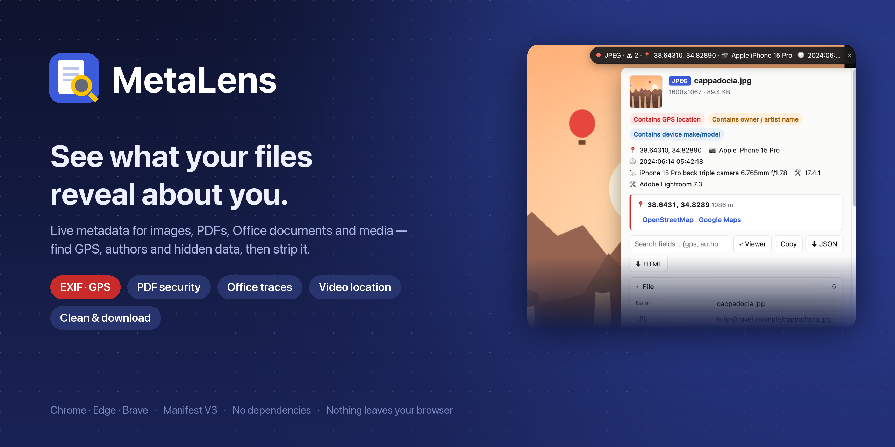
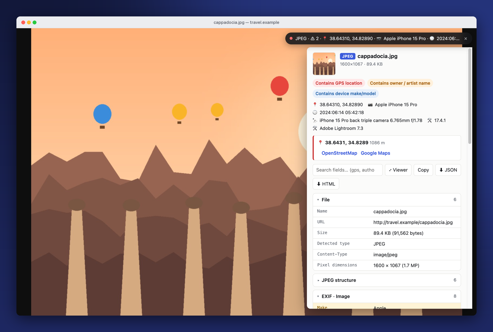
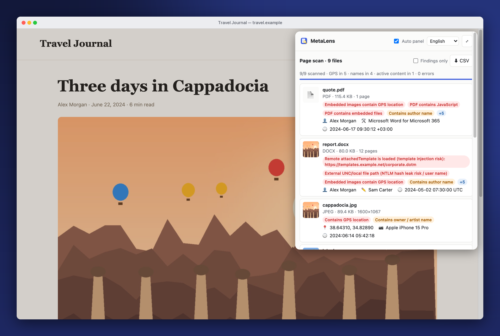
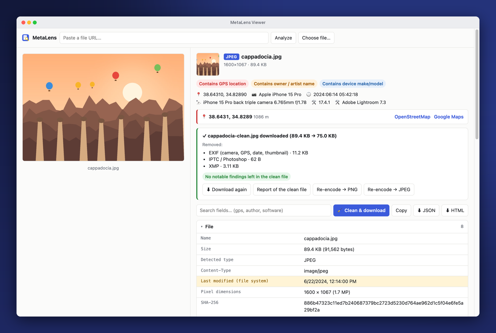
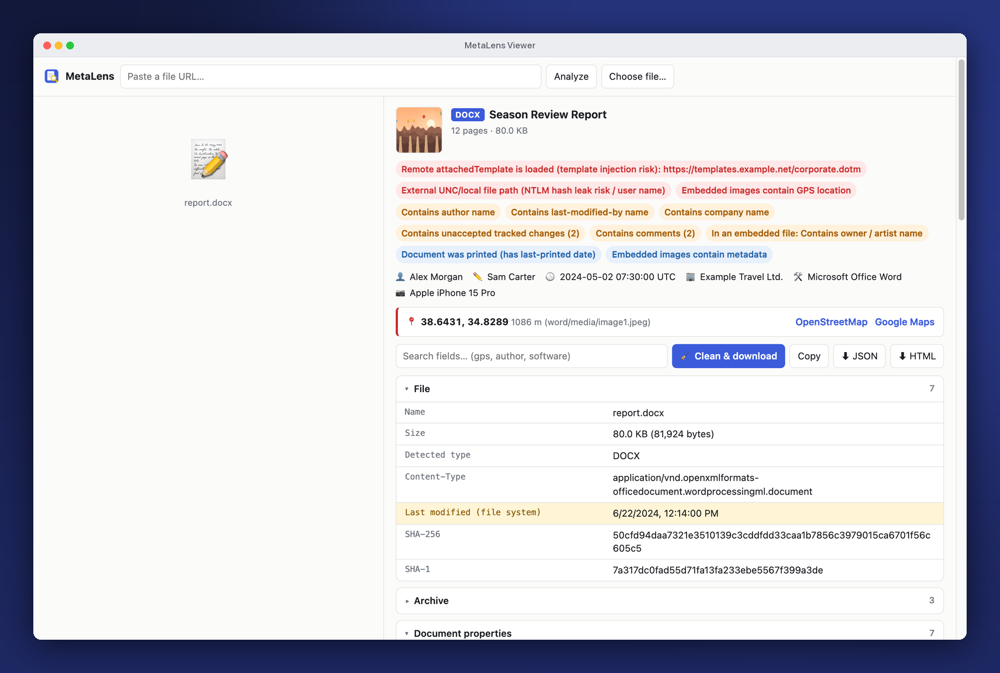
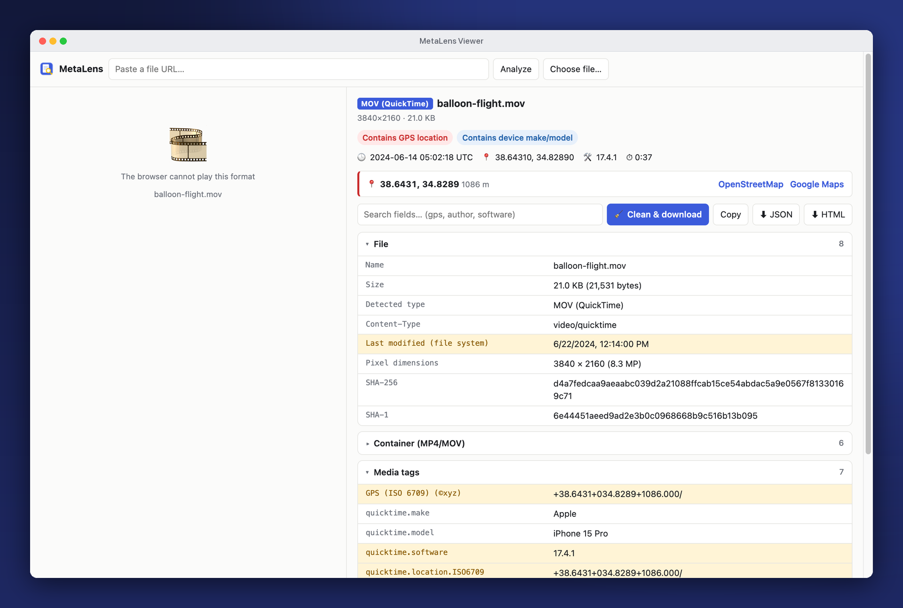
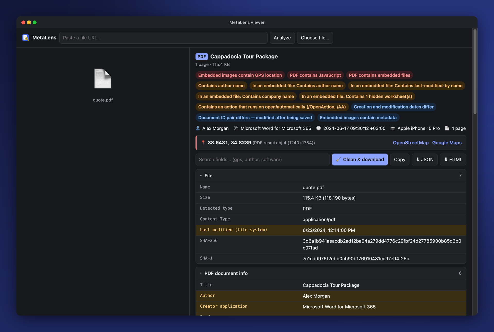
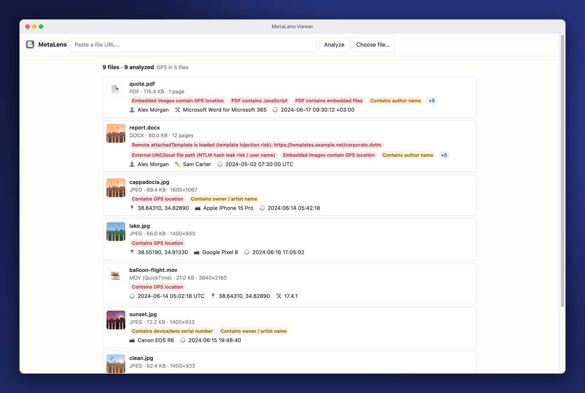
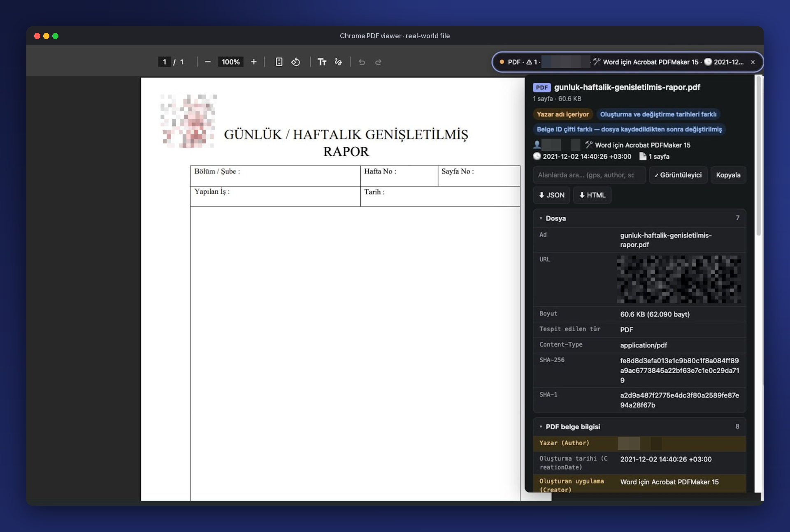

<div align="center">



<br>

[](https://github.com/gorkemguler/MetaLens/releases/latest)
[](LICENSE)


**English** · [Türkçe](README.tr.md)

[Features](#features) · [Screenshots](#screenshots) · [Install](#install) · [Usage](#usage) · [Formats](#supported-formats) · [Cleaning](#cleaning) · [Privacy](#privacy) · [Development](#development)

</div>

---

**MetaLens** is a browser extension that shows the live metadata of the images, PDFs, Office documents and media files you open. It flags GPS locations, authors, devices and hidden or active content — and can hand you a copy with the metadata removed.

## Features

- **Live panel** on image, PDF, video and audio tabs, plus a colour-coded toolbar badge
- **Page scan** — analyzes every image, document and media file on a page, sorted by risk, with CSV export
- **Location & identity** — EXIF GPS, iPhone/Android video location, camera serials, authors, companies, user IDs
- **Security indicators** — PDF JavaScript / attachments / launch actions, Office macros, remote template injection, UNC/NTLM leaks, SVG scripts, data hidden after end-of-file
- **Deep inspection** — EXIF inside PDFs and Office files, PDF attachments, passwordless encrypted PDFs (RC4 / AES-128 / AES-256)
- **Clean & download** — strips metadata from images, PDFs, Office files, video and audio
- **Export** — JSON or a self-contained HTML report
- **Large files** — only the metadata regions are fetched via HTTP Range (≈1 KB from a 100 MB video)
- **English / Türkçe** — follows the browser language, switchable from the popup

## Screenshots

<table>
  <tr>
    <td colspan="2"></td>
  </tr>
  <tr>
    <td colspan="2" align="center"><b>Live panel</b> — opens on top of any image, PDF, video or audio tab</td>
  </tr>
  <tr>
    <td width="50%"></td>
    <td width="50%"></td>
  </tr>
  <tr>
    <td align="center"><b>Page scan</b> — every file on the page, riskiest first</td>
    <td align="center"><b>Clean & download</b> — what was removed, what is left</td>
  </tr>
  <tr>
    <td></td>
    <td></td>
  </tr>
  <tr>
    <td align="center"><b>Office documents</b> — authors, company, template injection, UNC leaks</td>
    <td align="center"><b>Video</b> — iPhone/Android location and device keys</td>
  </tr>
  <tr>
    <td></td>
    <td></td>
  </tr>
  <tr>
    <td align="center"><b>PDF</b> — JavaScript, attachments, embedded image GPS (dark theme)</td>
    <td align="center"><b>Batch</b> — drop many files, see all findings in one list</td>
  </tr>
</table>

<sub>People, companies, places and files shown are fictional, generated with <code>docs/make_demo.py</code>.</sub>

### In the wild



<p align="center"><sub>A real-world PDF opened in Chrome's built-in viewer: MetaLens shows the author's name and the tool that produced it (Acrobat PDFMaker for Word) the moment the tab opens. Personal details are blurred.</sub></p>

## Install

1. Download **`metalens-<version>.zip`** from the [latest release](https://github.com/gorkemguler/MetaLens/releases/latest) and unzip it — or clone this repository.
2. Open `chrome://extensions` (Edge: `edge://extensions`, Brave: `brave://extensions`) and enable **Developer mode**.
3. Click **Load unpacked** and select the folder.
4. *Optional:* MetaLens → Details → **Allow access to file URLs** to analyze local `file://` files.

## Usage

| Where | What happens |
|---|---|
| **Image / PDF / video / audio tab** | A live pill appears top-right with the type, warning count, GPS, device and date. Click for the full report; <kbd>Esc</kbd> closes it. Works inside Chrome's PDF viewer. |
| **Toolbar badge** | Shows the file type; a `!` on red/orange means sensitive data was found. |
| **Popup on a normal page** | **Scan images, documents and media on this page** — with a *Findings only* filter and CSV export. |
| **Right-click** | *Show metadata* on images, video/audio and file links (including `blob:` and `data:` sources). |
| **Viewer** | Paste a URL or drag / paste one or more files. Export **JSON / HTML**, or **Clean & download**. |
| **Language** | *Automatic* / *Türkçe* / *English* from the popup header. |

## Supported formats

| Type | What MetaLens reads |
|---|---|
| **JPEG · PNG · WebP · GIF · TIFF · HEIC · AVIF · BMP** | EXIF (image, capture, GPS, embedded thumbnail), XMP incl. edit history, IPTC, ICC, PNG text, Stable Diffusion / ComfyUI parameters, C2PA traces, trailing hidden data |
| **SVG** | Generator comments, Inkscape file paths, `<script>` and event handlers |
| **PDF** | Info dictionary, XMP (incl. compressed object streams), EXIF/GPS of embedded JPEGs, attachments (analyzed recursively), object-level XMP, fonts, page size, revisions, document ID, pdfid-style scan (`/JavaScript`, `/OpenAction`, `/Launch`, `/EmbeddedFile`, hex-obfuscated names) |
| **Encrypted PDF** | Fields of PDFs that open without a password — RC4 40/128, AES-128, AES-256 (R5/R6) |
| **DOCX · XLSX · PPTX** | Author, last modified by, company, manager, editing time, template path, remote template injection, UNC/NTLM leaks, macros / ActiveX / OLE, tracked-change & comment authors, user IDs, hidden sheets, Excel save folder (`absPath`), data connections, Purview labels, embedded image EXIF |
| **ODT · ODS · ODP · EPUB · JAR/APK · ZIP** | ODF meta (initial author, printed by, editing time, template), EPUB OPF, Java manifest (`Built-By`), archive contents, executables, zip-slip / zip-bomb warnings |
| **DOC · XLS · PPT · MSG** | OLE SummaryInformation, Outlook email (subject, sender, recipients, IPs in headers, attachments), macros, password-protected Office detection |
| **MP4 · MOV · M4A · 3GP** | Creation time, duration, tracks & codecs, ISO 6709 location, QuickTime device keys, iTunes tags, cover art |
| **MP3 · FLAC · OGG/Opus · WAV · AVI · MKV/WebM** | ID3v1/v2 (cover, comments, PRIV, GEOB), Vorbis comments, RIFF INFO, Broadcast WAV (bext), iXML, Matroska tags & attachments |

Every report also includes size, SHA-256 / SHA-1 and HTTP response headers. Possibly sensitive fields are highlighted; click any row to copy its value.

## Cleaning

| Type | Method |
|---|---|
| JPEG · PNG · WebP · GIF · SVG · MP3 · FLAC · WAV | Rebuilt without metadata blocks — pixels and audio untouched; JPEG orientation kept |
| PDF · MP4 · MOV · M4A · HEIC · AVIF | Wiped **in place** so offsets stay valid; file size unchanged |
| DOCX · XLSX · PPTX · ODT · ODS · ODP | ZIP rewritten — properties removed, comment/revision authors anonymized, preview blanked, embedded images cleaned |
| Other images | *Re-encode → PNG/JPEG* redraws the pixels |

Anything that could not be removed is listed in the result (e.g. a VBA project, EXIF of images inside a PDF). Encrypted PDFs, MKV, OGG, AVI and legacy OLE files are analyzed but not cleaned.

## Privacy

- All parsing happens locally in the browser; there is no server and no telemetry.
- The only network request is the download of the file you are inspecting (with a Referer retry if the site blocks hotlinking).
- Local files you drop into the viewer never leave your computer.

## Development

<details>
<summary><b>Project layout</b></summary>

```
lib/i18n.js      language support        lib/i18n-en.js   English dictionary (source strings are Turkish)
lib/core.js      helpers, report model
lib/exif.js      EXIF/TIFF, XMP, IPTC, ICC
lib/images.js    JPEG, PNG, GIF, WebP, TIFF, BMP, ICO, SVG
lib/pdf.js       PDF parser              lib/pdfcrypt.js  PDF decryption (MD5, RC4, AES)
lib/office.js    ZIP/OOXML/ODF/EPUB/JAR, OLE/MSG
lib/media.js     ISOBMFF, ID3/MP3, FLAC, OGG, RIFF, EBML
lib/analyze.js   type detection, MetaParse API
lib/strip.js     cleaning                lib/loader.js    Range-based loading
lib/idb.js       page ↔ service worker transfer
lib/render.js    UI, JSON/HTML export
```
The script load order is defined in `lib/files.json`; `popup.html`, `viewer.html` and `background.js` must match it (checked by the tests).
</details>

<details>
<summary><b>Tests</b></summary>

```bash
python3 test/make_fixtures.py /tmp/ml-fx      # needs exiftool, ImageMagick, pypdf (macOS: sips, afconvert, textutil)
node test/run.mjs /tmp/ml-fx                  # parsers, cleaning, translations
node test/loader-test.mjs /tmp/ml-fx          # partial loading with 100 MB files
node test/e2e.mjs /tmp/ml-fx /tmp/ml-e2e      # end-to-end in headless Chrome for Testing
```
</details>

<details>
<summary><b>Release & README images</b></summary>

```bash
./scripts/package.sh                                        # dist/metalens-<version>.zip
python3 docs/make_demo.py /tmp/ml-demo-en en                # fictional demo files
node docs/screenshots.mjs /tmp/ml-demo-en docs/screenshots/en en
python3 docs/frame.py docs/screenshots/en en
python3 docs/make_banner.py en docs/screenshots/en/_raw/01-live-panel.png docs/banner-en.png
```
</details>

## Limitations

- Social platforms (X/Twitter, Instagram, WhatsApp…) strip EXIF on upload — "no metadata" there is expected.
- PDFs that require a user password and password-protected Office files can't be read; only their encryption info is shown.
- File limit is 512 MB; without HTTP Range support large files are downloaded in full.

## License

[MIT](LICENSE) © gorkemguler
