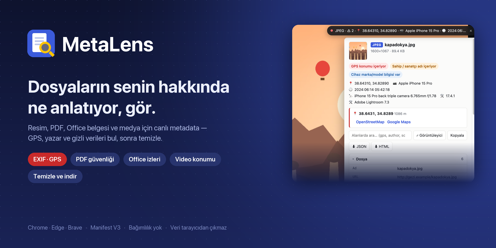
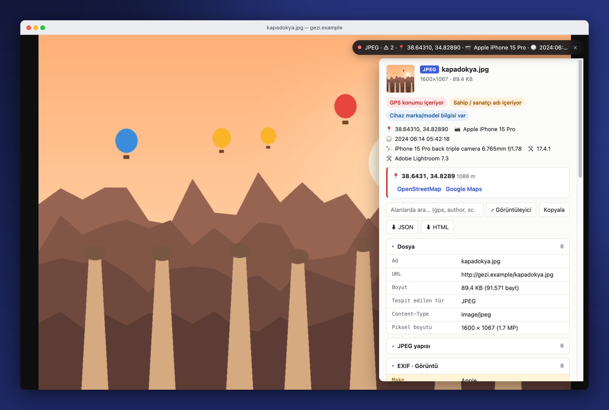
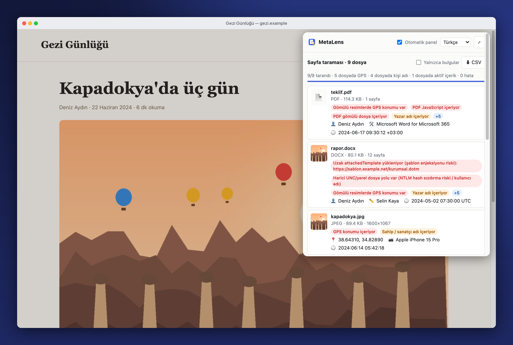
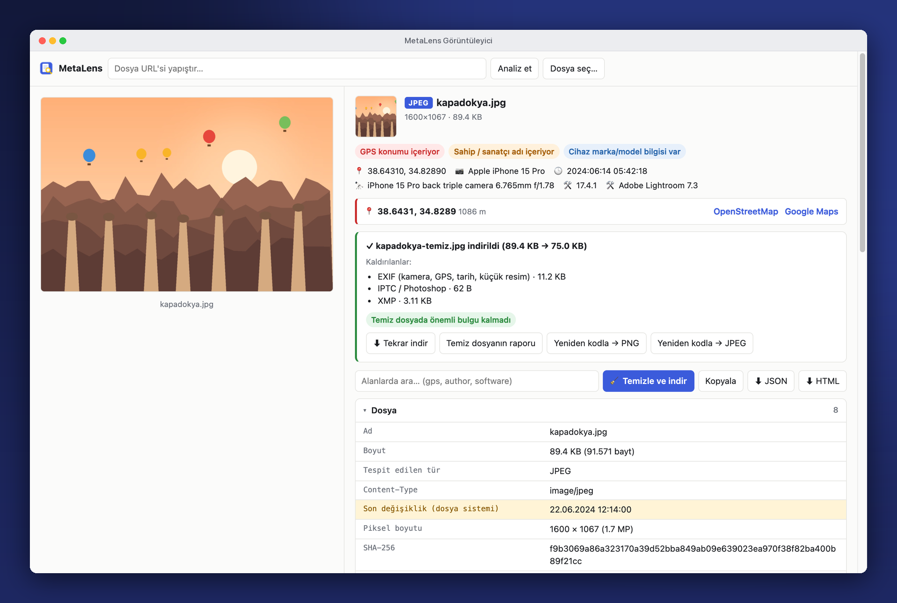
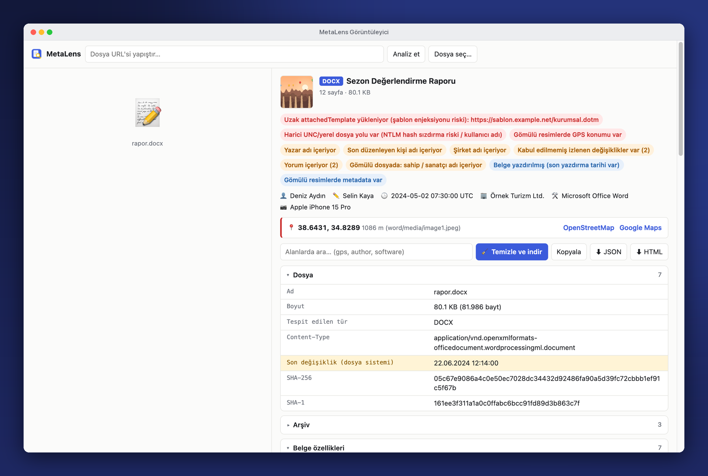
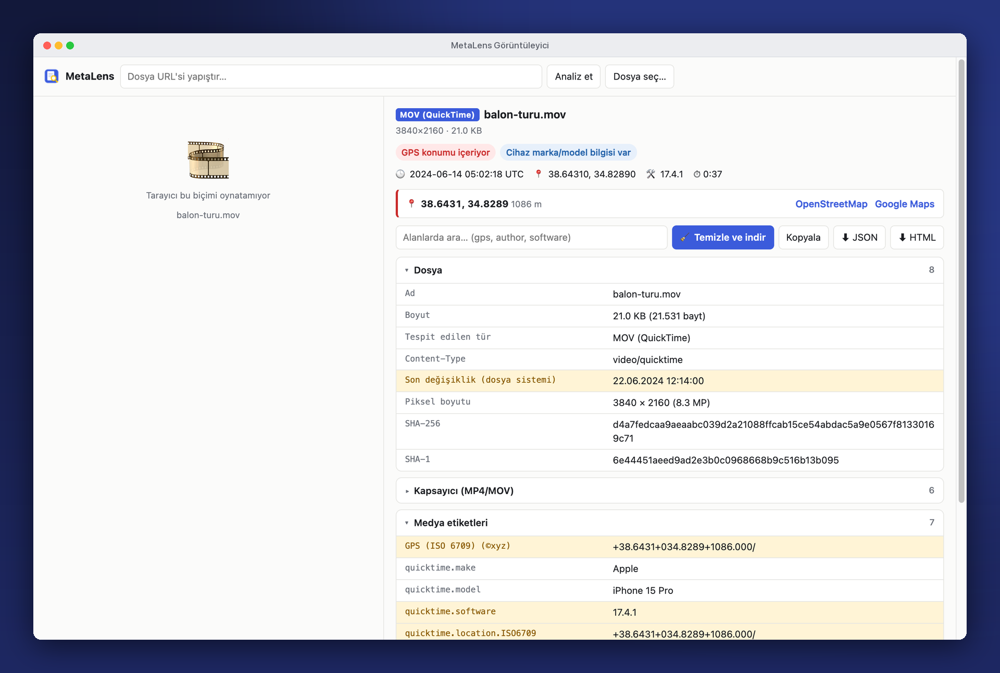
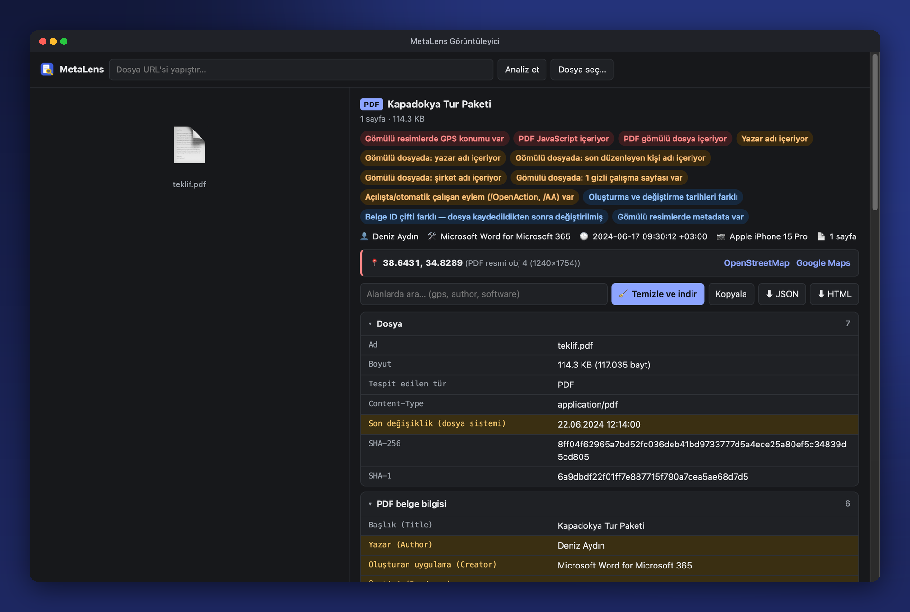
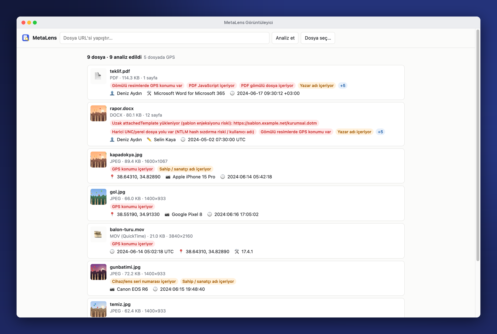
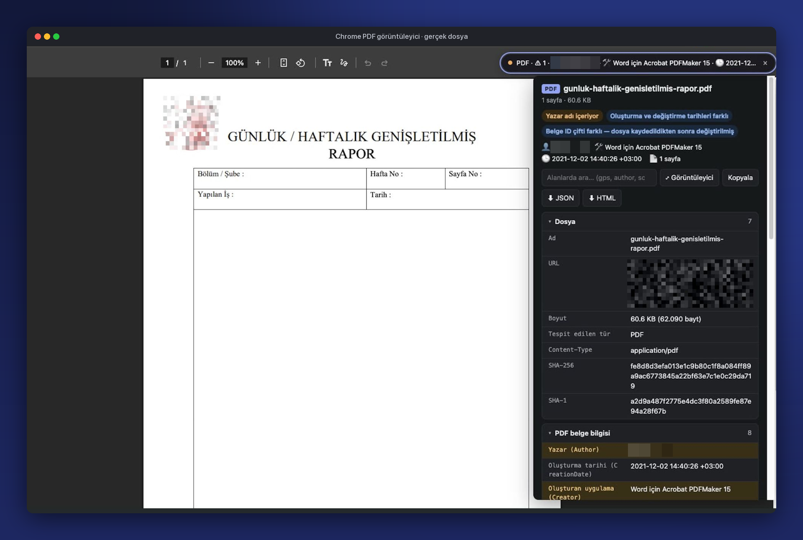

<div align="center">



<br>

[](https://github.com/gorkemguler/MetaLens/releases/latest)
[](LICENSE)


[English](README.md) · **Türkçe**

[Özellikler](#özellikler) · [Ekran görüntüleri](#ekran-görüntüleri) · [Kurulum](#kurulum) · [Kullanım](#kullanım) · [Biçimler](#desteklenen-biçimler) · [Temizleme](#temizleme) · [Gizlilik](#gizlilik) · [Geliştirme](#geliştirme) · [Wiki](https://github.com/gorkemguler/MetaLens/wiki/Home#türkçe)

</div>

---

**MetaLens**, açtığın resim, PDF, Office belgesi ve medya dosyalarının metadata'sını canlı gösteren bir tarayıcı eklentisidir. GPS konumlarını, yazarları, cihazları, gizli ve aktif içerikleri işaretler; istersen metadata'sı silinmiş bir kopyasını verir.

## Özellikler

- **Canlı panel**: resim, PDF, video ve ses sekmelerinde açılır; araç çubuğunda renkli rozet
- **Sayfa taraması**: sayfadaki tüm resim, belge ve medyaları riske göre sıralar, CSV'ye aktarır
- **Konum ve kimlik**: EXIF GPS, iPhone/Android video konumu, kamera seri numaraları, yazarlar, şirketler, kullanıcı kimlikleri
- **Güvenlik göstergeleri**: PDF JavaScript / ek / program çalıştırma eylemleri, Office makroları, uzak şablon enjeksiyonu, UNC/NTLM sızıntısı, SVG betikleri, dosya sonuna gizlenmiş veri
- **Derin inceleme**: PDF ve Office içindeki resimlerin EXIF'i, PDF ekleri, parolasız şifreli PDF'ler (RC4 / AES-128 / AES-256)
- **Temizle ve indir**: resim, PDF, Office, video ve ses dosyalarından metadata'yı siler
- **Dışa aktarma**: JSON ya da tek başına açılabilen HTML rapor
- **Büyük dosyalar**: HTTP Range ile yalnızca metadata bölgeleri indirilir (100 MB'lık videodan ≈1 KB)
- **Türkçe / English**: tarayıcı diline göre açılır, açılır pencereden değiştirilebilir

## Ekran görüntüleri

<table>
  <tr>
    <td colspan="2"></td>
  </tr>
  <tr>
    <td colspan="2" align="center"><b>Canlı panel</b>: her resim, PDF, video ve ses sekmesinin üzerinde açılır</td>
  </tr>
  <tr>
    <td width="50%"></td>
    <td width="50%"></td>
  </tr>
  <tr>
    <td align="center"><b>Sayfa taraması</b>: sayfadaki tüm dosyalar, en riskli önce</td>
    <td align="center"><b>Temizle ve indir</b>: neyin kaldırıldığı, neyin kaldığı</td>
  </tr>
  <tr>
    <td></td>
    <td></td>
  </tr>
  <tr>
    <td align="center"><b>Office belgeleri</b>: yazarlar, şirket, şablon enjeksiyonu, UNC sızıntısı</td>
    <td align="center"><b>Video</b>: iPhone/Android konum ve cihaz anahtarları</td>
  </tr>
  <tr>
    <td></td>
    <td></td>
  </tr>
  <tr>
    <td align="center"><b>PDF</b>: JavaScript, ekler, gömülü resim GPS'i (karanlık tema)</td>
    <td align="center"><b>Toplu analiz</b>: çok sayıda dosya bırak, bulguları tek listede gör</td>
  </tr>
</table>

<sub>Görsellerdeki kişi, şirket, yer ve dosyalar kurgusaldır; <code>docs/make_demo.py</code> ile üretilmiştir.</sub>

### Gerçek kullanımda



<p align="center"><sub>Chrome'un kendi görüntüleyicisinde açılmış gerçek bir PDF: sekme açılır açılmaz MetaLens yazarın adını ve belgeyi üreten aracı (Word için Acrobat PDFMaker) gösteriyor. Kişisel bilgiler karartılmıştır.</sub></p>

## Kurulum

1. [Son sürümden](https://github.com/gorkemguler/MetaLens/releases/latest) **`metalens-<sürüm>.zip`** dosyasını indirip aç ya da bu depoyu klonla.
2. `chrome://extensions` (Edge: `edge://extensions`, Brave: `brave://extensions`) sayfasında **Geliştirici modu**nu aç.
3. **Paketlenmemiş öğe yükle** butonuna bas ve klasörü seç.
4. *İsteğe bağlı:* yerel `file://` dosyaları için MetaLens → Ayrıntılar → **Dosya URL'lerine erişime izin ver**.

## Kullanım

| Nerede | Ne olur |
|---|---|
| **Resim / PDF / video / ses sekmesi** | Sağ üstte tür, uyarı sayısı, GPS, cihaz ve tarihi gösteren canlı bir şerit belirir. Tıklayınca tüm rapor açılır; <kbd>Esc</kbd> kapatır. Chrome'un PDF görüntüleyicisinde de çalışır. |
| **Araç çubuğu rozeti** | Dosya türünü gösterir; kırmızı/turuncu zeminde `!` hassas veri bulunduğunu belirtir. |
| **Normal sayfada açılır pencere** | **Sayfadaki resim, belge ve medyaları tara**: *Yalnızca bulgular* filtresi ve CSV dışa aktarma ile. |
| **Sağ tık** | Resim, video/ses ve dosya bağlantılarında *metadata'sını göster* (`blob:` ve `data:` kaynaklar dahil). |
| **Görüntüleyici** | URL yapıştır ya da bir veya birden çok dosya sürükle / yapıştır. **JSON / HTML** dışa aktar veya **Temizle ve indir**. |
| **Dil** | Açılır pencerenin başlığından *Otomatik* / *Türkçe* / *English*. |

## Desteklenen biçimler

| Tür | MetaLens'in okudukları |
|---|---|
| **JPEG · PNG · WebP · GIF · TIFF · HEIC · AVIF · BMP** | EXIF (görüntü, çekim, GPS, gömülü küçük resim), düzenleme geçmişiyle XMP, IPTC, ICC, PNG metinleri, Stable Diffusion / ComfyUI parametreleri, C2PA izleri, dosya sonuna gizlenmiş veri |
| **SVG** | Üretici yorumları, Inkscape dosya yolları, `<script>` ve olay işleyicileri |
| **PDF** | Bilgi sözlüğü, XMP (sıkıştırılmış nesne akışları dahil), gömülü JPEG'lerin EXIF/GPS'i, ekler (içerikleriyle analiz edilir), nesne düzeyinde XMP, fontlar, sayfa boyutu, revizyonlar, belge kimliği, pdfid tarzı tarama (`/JavaScript`, `/OpenAction`, `/Launch`, `/EmbeddedFile`, hex ile gizlenmiş adlar) |
| **Şifreli PDF** | Parolasız açılan PDF'lerin alanları: RC4 40/128, AES-128, AES-256 (R5/R6) |
| **DOCX · XLSX · PPTX** | Yazar, son düzenleyen, şirket, yönetici, düzenleme süresi, şablon yolu, uzak şablon enjeksiyonu, UNC/NTLM sızıntısı, makro / ActiveX / OLE, izlenen değişiklik ve yorum yazarları, kullanıcı kimlikleri, gizli sayfalar, Excel kayıt klasörü (`absPath`), veri bağlantıları, Purview etiketleri, gömülü resimlerin EXIF'i |
| **ODT · ODS · ODP · EPUB · JAR/APK · ZIP** | ODF meta (ilk yazar, yazdıran, düzenleme süresi, şablon), EPUB OPF, Java manifest (`Built-By`), arşiv içeriği, çalıştırılabilir dosyalar, zip slip / zip bomb uyarıları |
| **DOC · XLS · PPT · MSG** | OLE SummaryInformation, Outlook e-postası (konu, gönderen, alıcılar, başlıklardaki IP'ler, ekler), makrolar, parolalı Office tespiti |
| **MP4 · MOV · M4A · 3GP** | Oluşturma zamanı, süre, izler ve kodekler, ISO 6709 konumu, QuickTime cihaz anahtarları, iTunes etiketleri, kapak resmi |
| **MP3 · FLAC · OGG/Opus · WAV · AVI · MKV/WebM** | ID3v1/v2 (kapak, yorumlar, PRIV, GEOB), Vorbis yorumları, RIFF INFO, Broadcast WAV (bext), iXML, Matroska etiketleri ve ekleri |

Her rapor ayrıca boyut, SHA-256 / SHA-1 ve HTTP yanıt başlıklarını içerir. Hassas olabilecek alanlar vurgulanır; herhangi bir satıra tıklayınca değeri kopyalanır.

## Temizleme

| Tür | Yöntem |
|---|---|
| JPEG · PNG · WebP · GIF · SVG · MP3 · FLAC · WAV | Metadata blokları olmadan yeniden kurulur; piksel ve ses verisine dokunulmaz, JPEG yönlendirmesi korunur |
| PDF · MP4 · MOV · M4A · HEIC · AVIF | Ofsetler bozulmasın diye **yerinde** silinir; dosya boyutu değişmez |
| DOCX · XLSX · PPTX · ODT · ODS · ODP | ZIP yeniden yazılır: özellikler silinir, yorum/değişiklik yazarları anonimleştirilir, önizleme boşaltılır, gömülü resimler temizlenir |
| Diğer resimler | *Yeniden kodla → PNG/JPEG* pikselleri yeniden çizer |

Kaldırılamayanlar sonuçta açıkça listelenir (ör. VBA projesi, PDF içindeki resimlerin EXIF'i). Şifreli PDF, MKV, OGG, AVI ve eski OLE dosyaları analiz edilir ama temizlenmez.

## Gizlilik

- Tüm ayrıştırma tarayıcıda yerel olarak yapılır; sunucu ve telemetri yoktur.
- Tek ağ isteği, incelediğin dosyanın indirilmesidir (site hotlink'i engellerse Referer ile yeniden denenir).
- Görüntüleyiciye bıraktığın yerel dosyalar bilgisayarından çıkmaz.

## Geliştirme

<details>
<summary><b>Proje yapısı</b></summary>

```
lib/i18n.js      dil desteği             lib/i18n-en.js   İngilizce sözlük (kaynak metinler Türkçe)
lib/core.js      yardımcılar, rapor yapısı
lib/exif.js      EXIF/TIFF, XMP, IPTC, ICC
lib/images.js    JPEG, PNG, GIF, WebP, TIFF, BMP, ICO, SVG
lib/pdf.js       PDF ayrıştırıcı         lib/pdfcrypt.js  PDF şifre çözme (MD5, RC4, AES)
lib/office.js    ZIP/OOXML/ODF/EPUB/JAR, OLE/MSG
lib/media.js     ISOBMFF, ID3/MP3, FLAC, OGG, RIFF, EBML
lib/analyze.js   tür tespiti, MetaParse API
lib/strip.js     temizleme               lib/loader.js    Range'li yükleme
lib/idb.js       sayfa ↔ service worker veri taşıma
lib/render.js    arayüz, JSON/HTML dışa aktarma
```
Betik yükleme sırası `lib/files.json` dosyasındadır; `popup.html`, `viewer.html` ve `background.js` bu listeyle uyumlu olmalı (testler kontrol eder).
</details>

<details>
<summary><b>Testler</b></summary>

```bash
python3 test/make_fixtures.py /tmp/ml-fx      # exiftool, ImageMagick, pypdf gerekir (macOS: sips, afconvert, textutil)
node test/run.mjs /tmp/ml-fx                  # ayrıştırıcılar, temizleme, çeviriler
node test/loader-test.mjs /tmp/ml-fx          # 100 MB dosyalarla kısmi yükleme
node test/e2e.mjs /tmp/ml-fx /tmp/ml-e2e      # başsız Chrome for Testing'de uçtan uca
```
</details>

<details>
<summary><b>Sürüm ve README görselleri</b></summary>

```bash
./scripts/package.sh                                        # dist/metalens-<sürüm>.zip
python3 docs/make_demo.py /tmp/ml-demo-tr tr                # kurgusal demo dosyaları
node docs/screenshots.mjs /tmp/ml-demo-tr docs/screenshots/tr tr
python3 docs/frame.py docs/screenshots/tr tr
python3 docs/make_banner.py tr docs/screenshots/tr/_raw/01-live-panel.png docs/banner-tr.png
```
</details>

## Sınırlar

- Sosyal platformlar (X/Twitter, Instagram, WhatsApp…) yüklenen resimlerin EXIF'ini siler; oralarda "metadata yok" çıkması normaldir.
- Kullanıcı parolası isteyen PDF'ler ve parolalı Office dosyaları okunamaz; yalnızca şifreleme bilgisi gösterilir.
- Dosya sınırı 512 MB'tır; HTTP Range desteklenmiyorsa büyük dosyalar tamamen indirilir.

## Lisans

[MIT](LICENSE) © gorkemguler
